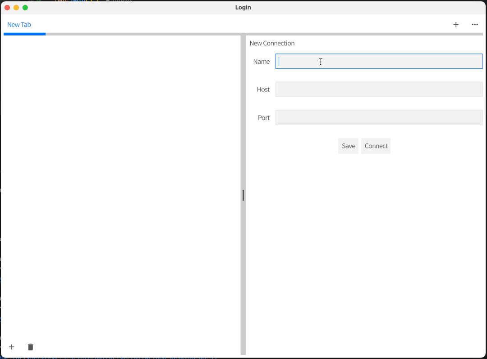

# etcder

<p align="center">
    
</p>

English | [简体中文](./README-CN.md)

etcder is a cross-platform visual interface that assists you in connecting your etcd cluster.


## Getting Started

### Getting etcder
The easiest way is to directly download the corresponding version from the release.

Also you can download the source code and compile it.
```bash
bash build/package.sh v0.1
```

### Demo



